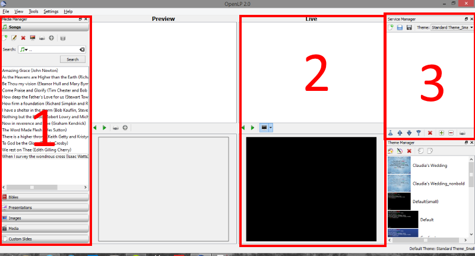
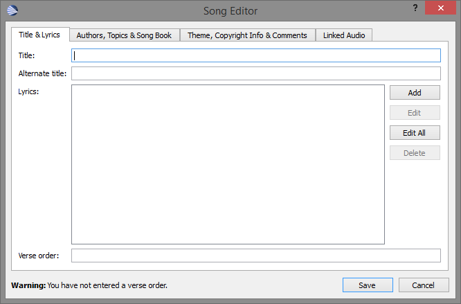
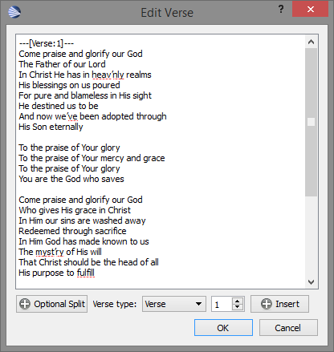
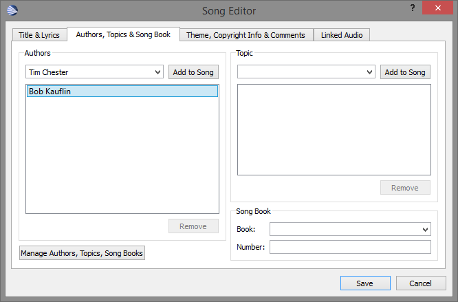
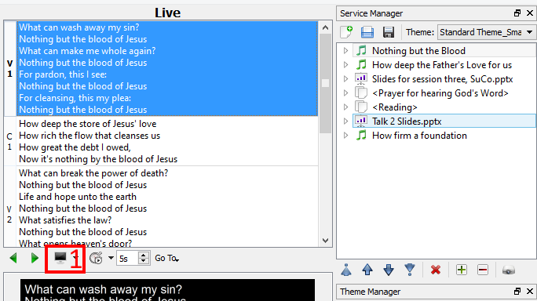

#OpenLP Users Guide

##1. Overview

If you're just interested in how to run a service, read through this overview section, then skip straight to [Running a Service](#running-a-service).

You can download a PDF of this web page [here](openlp_instructions.pdf).


The 3 main areas relevant to running a service with OpenLP are shown in the picture above.

1. __Media Manager__: Contains all the items you might want to put into a service in individual tabs. The key ones are [Songs](#songs), [Presentations](#presentations), [Media](#media) and [Custom Slides](#custom-slides).
2. __Live Panel__: Contains the item (e.g. song) of the service currently on-screen. Allows you to go between verses, change slides, or control playback of a video.
3. __Service Manager__: Contains all the items in the current service. Allows you to change between different items, e.g. go to the next song.


##2. Creating a Service

<h3 id="songs">Songs</h3>

Adding songs to a service is as simple as choosing a song from the list (you can search by title, lyrics or authors in the search box), and pressing the grey + button at the top of the songs tab. You can also just drag and drop the song from the list to the Service Manager (3) on the right.

####Adding or Editing a Song
If the song you want isn't in the database, press the "Add new Song" button at the left of the toolbar in the Songs section. If you want to edit an existing song, right click on the song and choose Edit.



Fill in the Title, then you're ready to add the lyrics. The easiest way to add the lyrics is to press the "Edit All button", and paste the lyrics into the box.



Next, you need to tell OpenLP where the Verses and Choruses are. You can do this by either manually typing ``---[Verse:1]---``, ``---[Chorus:1]---`` etc., or by putting the cursor where the verse starts, choosing the verse type and which number it is, and pressing _Insert_.

Try to make sure you only use each verse number once. There should be no repeated verses or choruses at this stage: OpenLP can deal with that separately.

Don't forget to remove any copyright information from the end.


After the lyrics have been entered and the Verse indicators added, press _OK_, and fill in the verse order box. This lets you tell OpenLP what order the verses and choruses should appear. For example, putting ```V1 C1 V2 C1 V3 C1``` will do each verse with the chorus in between each one.

Next, click the "Authors, Topics & Song Book" tab in the Song Editor.



Add the authors individually by typing their name and clicking "Add to Song".

Finally, click the "Theme, Copyright Info & Comments" tab, and enter the copyright line into the copyright box, e.g. ```© 2011 Sovereign Grace Praise (BMI)```.

Now press "Save", and you're done!


<h3 id="presetations">Presentations</h3>

If you're taking a powerpoint off a USB stick, don't forget to copy it to the computer first so that you don't need to have it plugged in for the whole service.

To add a presentation to OpenLP, press the "Load new Presentation" button (the little folder at the top of the Presentations tab), and open the presentation.

Adding a presentation takes a few seconds as thumbnail images of the slides are generated, just wait until it's done.

To add a presentation to a service, just drag it over to the box on the right (3), or press the (+) button.

<h3 id="media">Media</h3>

Adding media (videos) is the same as a presentation - press the blue folder button, or drag the video file onto the list, then drag it from the list onto the service manger list (3).

<h3 id="custom-slides">Custom Slides</h3>

Custom slides are for things like liturgy. Adding a new one is very similar to adding a new song, and adding Custom Slides to the service is the same as for any other service item.


<h2 id="running-a-service">3. Running a Service</h2>



Running a service can be done with the mouse alone, but is probably easier with the keyboard.

To move between items in the service manager (e.g. songs), double click on the item in the list, or use the __left__ and __right__ arrow keys. To move between verses in a song or slides in a presentation, click on them in the list under "Live", or use the __up__ and __down__ arrow keys.


If you want to blank the display you can use the button indicated on the picture above with the red box, or you can press the period button on your keyboard.


